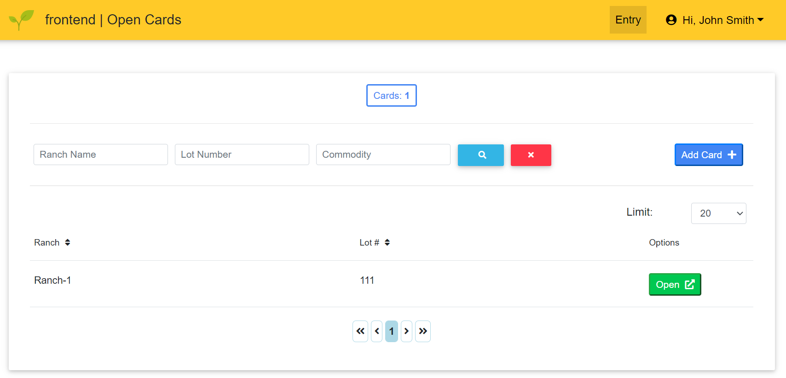
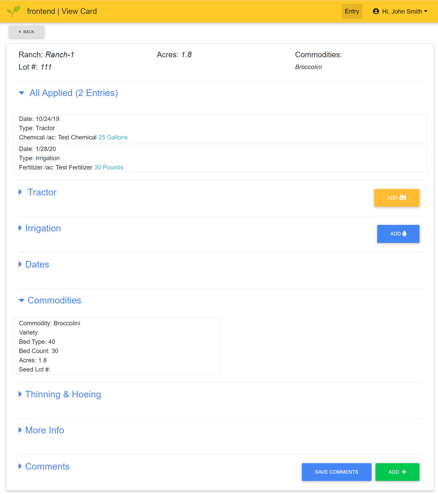
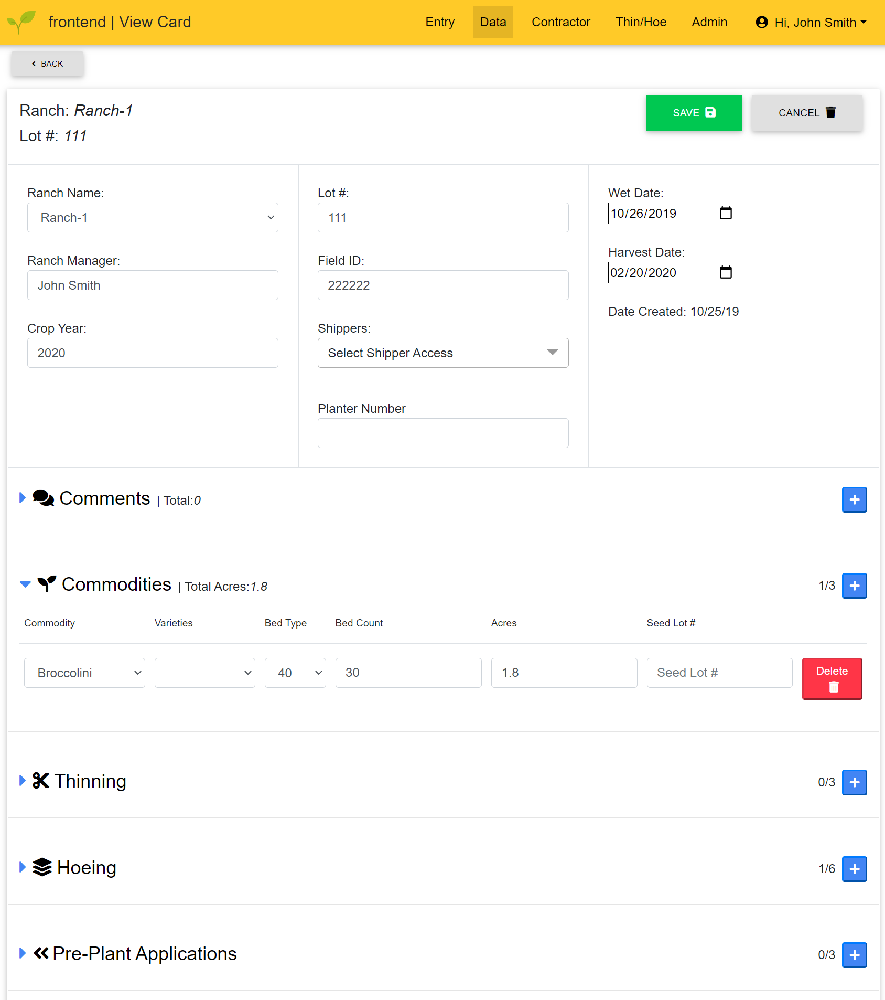

  
# 🌱 PlantLogic | Frontend

## **Overview**

A Dockerized Angular 12 frontend for the PlantLogic webapp. Served as a single page application which utilizes Angular routing.

The frontend allows users to view or manage data in some capacity. There are 3 different sets of data that users can interact with, each requiring separate permissions:

### Card Data

> A “Card” is the primary structural unit by which data is stored. Referring to physical note cards which they serve to replace, a card contains information on one or more commodities and the location where they exist (e.g. a ranch name and a lot number). In addition to those identifying pieces of information, a card also holds information on the fertilizers and chemicals used, hoeing and thinning operations, tractor work, irrigation work, and more. User permissions allow users to create cards, access cards via a permitted ranch, view some or all information on an accessible card, and edit some or all information on an accessible card.

### Common Data

> Common data includes pieces of data shared between cards and helps to standardize data input and allows for easier data analysis. Common data involves things like chemical and fertilizer names and rates of measurements, commodity names, ranch names, types of tractor work, etc.. Editing common data requires the admin permission. 

### User Data

> User data includes a user’s username, permissions, a set of ranches they are allowed to view or edit, and miscellaneous other data. Editing user data requires the user management permission.

 

## **Usage**

### Development

> To disable authentication (so the frontend can be navigated freely), serve the application with the following configuration:
`ng serve -c disableAuth`
> Or to use the demo server's API, run with: `ng serve -c demoServerAPI`

### Docker Environment Variables

> * **APP_NAME:** The name of the app, eg. `PlantLogic`
> * **REDIRECT_URL:** The URL to redirect to if the server isn't accessed from a valid URL, eg. `example.com`
> * **FRONTEND_URL:** The URL to access the frontend at, eg. `example.com`
> * **API_URL:** The URL to access the API at, eg. `api.example.com`
> * **APP_URL:** This overrides both `FRONTEND_URL` and `API_URL` - if `APP_URL` is set to `example.com`, then `FRONTEND_URL` is set to `example.com` and `API_URL` is set to `example.com/api`

## Example Images

User With Only Data Entry Permission  

 
 
User With Full Data Management Permission  

